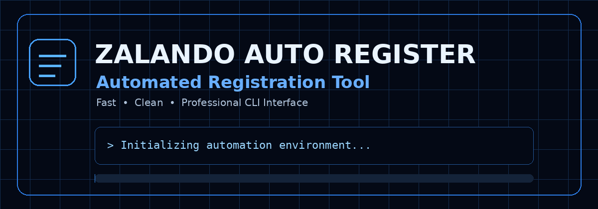

# 🚀 Zalando Auto Register Bot

<div align="center">



<br>

**Automated Registration Tool**

Fast · Clean · Professional CLI Interface

<br><br>

[](https://www.python.org/)
[](#-requirements)
[](#-license)
[](#)

<br>

**[Features](#-features) · [Installation](#-installation) · [Usage](#-usage) · [Troubleshooting](#-troubleshooting)**

</div>

---

## 📖 Overview

**Zalando Auto Register Bot** adalah project Python berbasis CLI yang mengotomatisasi alur registrasi akun pada environment yang diizinkan.

Project ini dibuat dengan fokus pada interface terminal yang bersih, proses yang mudah dipantau, dan penyimpanan hasil yang terstruktur.

> **Important:** Gunakan hanya pada akun, environment, dan layanan yang Anda berwenang untuk mengotomatisasi. Jangan digunakan untuk spam, penyalahgunaan, atau melewati mekanisme keamanan/rate limit platform.

---

## ✨ Features

| Feature | Description |
|:--|:--|
| 🎨 **Beautiful CLI** | Interface terminal dengan warna dan ASCII banner |
| ⚡ **Email Alias** | Dukungan pola alias seperti `+1`, `+2`, `+3` jika provider mendukung |
| 👤 **Random Names** | Generate kombinasi nama secara otomatis |
| 💾 **Auto Save** | Hasil proses disimpan ke `akun.txt` |
| 📊 **Live Progress** | Status proses ditampilkan secara real-time |
| 🔄 **Bulk Processing** | Memproses beberapa item dalam satu sesi |
| 🎯 **Clean Summary** | Ringkasan hasil ditampilkan setelah proses selesai |

---

## 🖥️ Preview


### Example CLI

```text
╔══════════════════════════════════════════╗
║    AUTO REGISTER ACCOUNT • ©Masjjoooo   ║
╚══════════════════════════════════════════╝

Email       : user@example.com
Password    : ********
Jumlah      : 10

Starting process...

[01/10] user+1@example.com    ✓ SUCCESS
[02/10] user+2@example.com    ✓ SUCCESS
[03/10] user+3@example.com    ✗ FAILED

──────────────────────────────────────────
SUCCESS : 02
FAILED  : 01
TOTAL   : 03
──────────────────────────────────────────
```

---

## ⚙️ Installation

### 1. Clone Repository

```bash
git clone https://github.com/Masjjoooo/Jalando_Register.git
cd Jalando_Register
```

### 2. Install Dependencies

```bash
pip install -r requirements.txt
```

Or manually:

```bash
pip install requests
```

### 3. Run

```bash
python mantap.py
```

---

## 🚀 Usage

Jalankan:

```bash
python mantap.py
```

Kemudian masukkan data yang diminta oleh program.

| Input | Example |
|:--|:--|
| Email | `user@example.com` |
| Password / Secret | `password123` |
| Jumlah | `10` |

Konfirmasi proses apabila diminta, kemudian pantau status pada terminal.

---

## 📄 Output

Hasil proses disimpan di:

```text
akun.txt
```

Contoh format:

```text
email+1@example.com|password123|Andi Santoso|SUCCESS
email+2@example.com|password123|Citra Wijaya|SUCCESS
email+3@example.com|password123|Budi Pratama|FAILED-429
```

---

## 📁 Project Structure

```text
zalando-auto-register/
│
├── assets/
│   └── banner.gif
│
├── mantap.py
├── akun.txt
├── requirements.txt
├── README.md
└── LICENSE
```

---

## 🧩 Requirements

- Python **3.8+**
- `requests`
- Windows / Linux / macOS / Termux

Check Python:

```bash
python --version
```

Install dependency:

```bash
pip install requests
```

---

## ⚠️ Important Notes

### 🔐 Session Data

Jika implementasi Anda menggunakan session-based request, beberapa data seperti cookie, CSRF token, request ID, atau flow/session identifier dapat berubah.

Gunakan hanya session dan credentials yang sah dan berada dalam kendali Anda.

### ⏱️ Rate Limiting

Server dapat membatasi request yang terlalu sering. Response seperti:

```text
429 Too Many Requests
```

berarti server sedang menerapkan rate limit.

Jangan mencoba melewati pembatasan tersebut. Kurangi request dan ikuti aturan layanan terkait.

### 📧 Email Alias

Format seperti:

```text
user+1@example.com
user+2@example.com
user+3@example.com
```

hanya bekerja apabila email provider yang digunakan mendukung alias tersebut.

---

## 🛠️ Troubleshooting

| Problem | Solution |
|:--|:--|
| `ModuleNotFoundError: requests` | Jalankan `pip install requests` |
| `401 Unauthorized` | Periksa authentication/session yang sah |
| `403 Forbidden` | Periksa konfigurasi request dan permission |
| `429 Too Many Requests` | Hentikan sementara request dan tunggu |
| Warna CLI tidak muncul | Gunakan terminal yang mendukung ANSI color |
| Script tidak berjalan | Pastikan Python dan dependencies sudah terinstall |

---

## 🤝 Contributing

Contributions, improvements, dan bug fixes dipersilakan.

```bash
git checkout -b feature/AmazingFeature
git add .
git commit -m "Add AmazingFeature"
git push origin feature/AmazingFeature
```

Kemudian buka **Pull Request** pada repository.

---

## 📜 License

Distributed under the **MIT License**.

See `LICENSE` for more information.

---

## ⚠️ Disclaimer

This project is provided for **educational, testing, and research purposes**.

- ❌ Tidak untuk spam atau abusive activity.
- ❌ Jangan digunakan untuk bypass security atau access controls.
- ❌ Jangan digunakan pada akun yang bukan milik atau berada di bawah wewenang Anda.
- ✅ Ikuti Terms of Service platform yang digunakan.
- ✅ Gunakan secara bertanggung jawab.

**The author is not responsible for misuse of this software.**

---

<div align="center">

### 💙 Made with Passion by **@Masjjoooo**

⭐ **If this project is useful, consider giving it a star!** ⭐

<br>

`© Masjjoooo`

</div>
